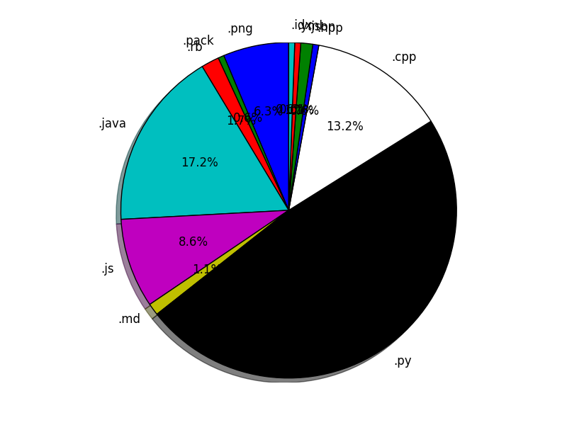
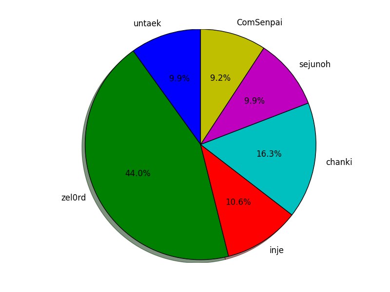

# goalgo.github.io
알고리즘 문제풀이 모음 🔥!!
  
도움이 필요하거나 코드 리뷰를 받고 싶으면 풀리퀘스트를 요청하시오.

---------------------------------------

## Programmers_file 제목 작성 요령
### CODING_TEST
- [ 문제_작성자.확장자 ] 형식으로 만든다.
- 문제 사이의 공백은 _ 으로 표시한다.
- 문제와 작성자 사이에도 _ 을 추가한다.
### SKILL_CHECK
- [ LEVEL\d-\d_작성자.확장자 ] 형식으로 만든다
- 문제 사이의 공백은 _ 으로 표시한다.
- 문제와 작성자 사이에도 _ 을 추가한다.

## BaekJoon 제목 작성 요령
- [ 문제번호_작성자.확장자 ] 형식으로 만든다.
- 문제 사이의 공백은 _ 으로 표시한다.
- 문제와 작성자 사이에도 _ 을 추가한다.

  

---------------------------------------
## VISUALIZE
### 2019-05-23_12-26-16

Language distribution
  

User distribution
  

## Reference

[https://programmers.co.kr](https://programmers.co.kr)
